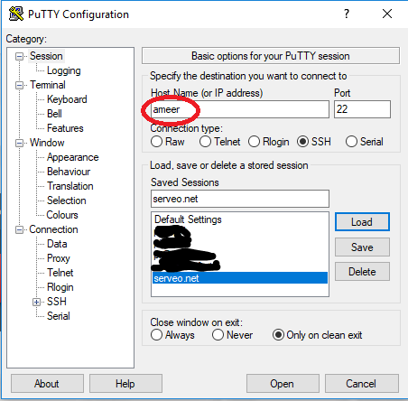
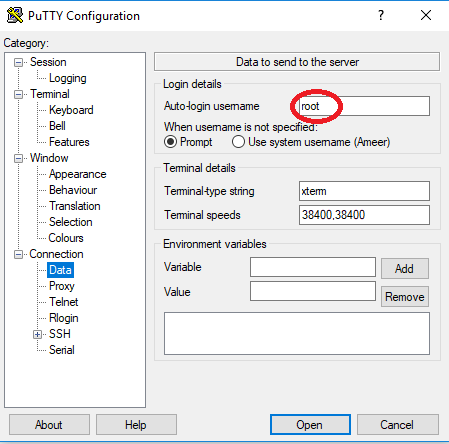
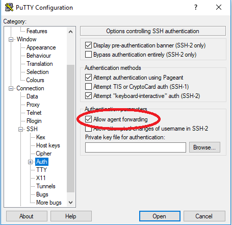
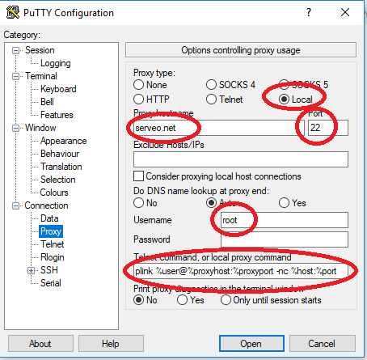
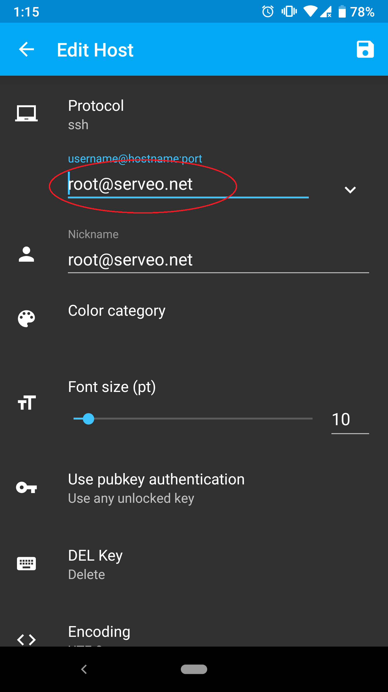
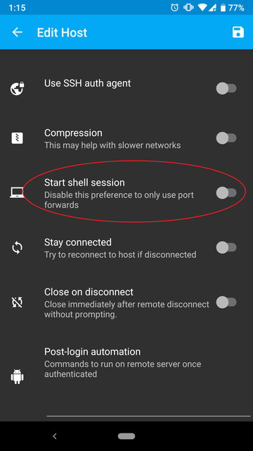
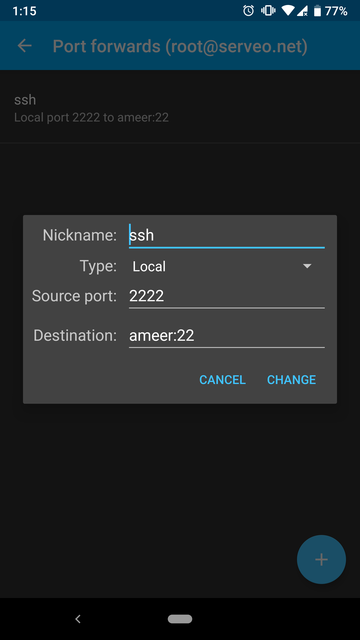
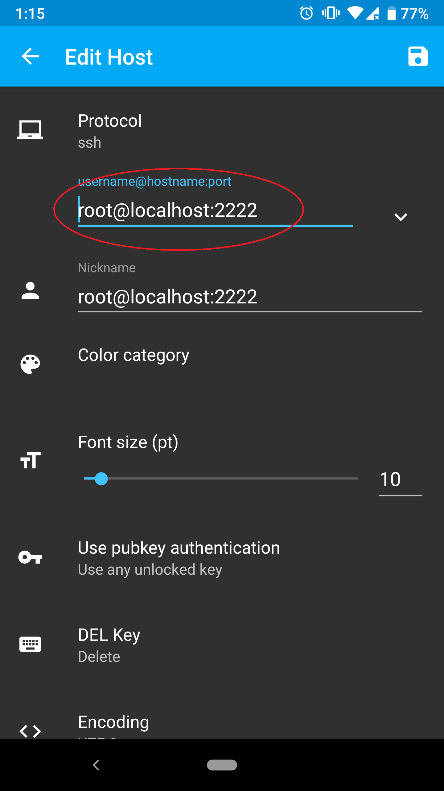

#### Setup serveo proxy access in Putty
* Enter serveo alias as hostname in Putty.

* Enter login username in `Connection > Data`

* Tick `Allow agent forewarding` in `Connection > SSH > Auth`

* Select proxy type `local` in `Connection > Proxy`
* Enter proxy hostname`serveo.net` and port `22` in `Connection > Proxy`
* Enter login username in `Connection > Proxy`
* Enter telnet command / local proxy command `plink %user@%proxyhost:%proxyport -nc %host:%port` in `Connection > Proxy`

#### Setup serveo proxy access in ConnectBot
* Add a host with `root@serveo.net`

* Untick `Start shell session` and save.

* Long tap on the newly created host and select `Edit port forwards`

* Add a port forward with Type `local`, Source port `2222` and destination `serveo_alias:22` where `serveo_alias` is the alias given to serveo connection. Then click create port forward.

* Add a new host with `username@localhost:2222` where `username` is the login username.

* Now connect to the first host and leave the connection unclosed.
* Connect to the second host and you should have a login shell.
